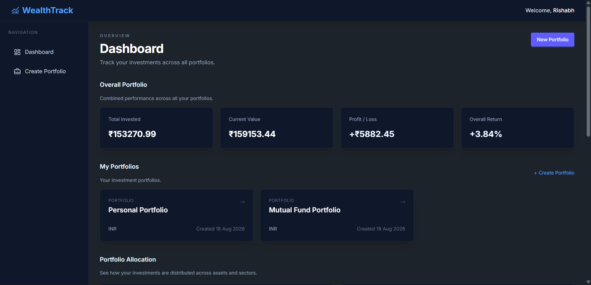
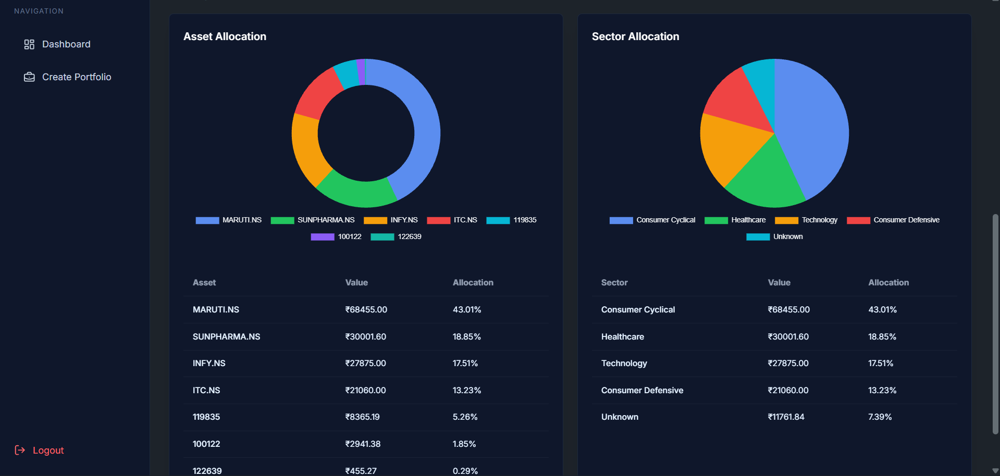
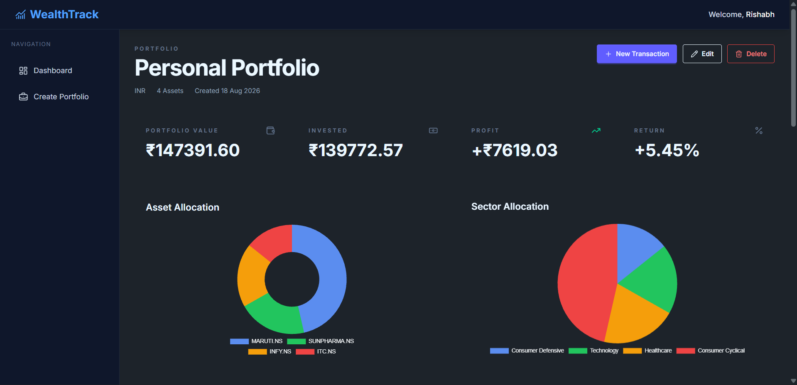
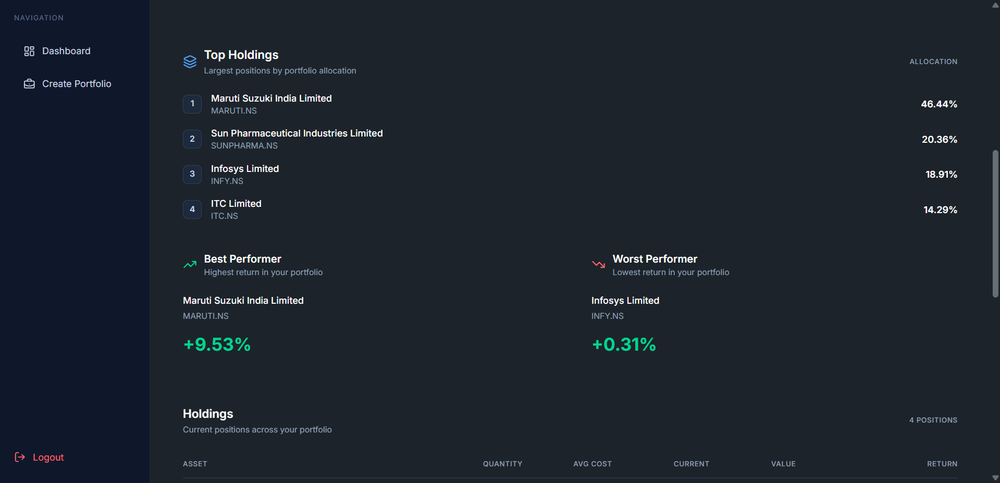
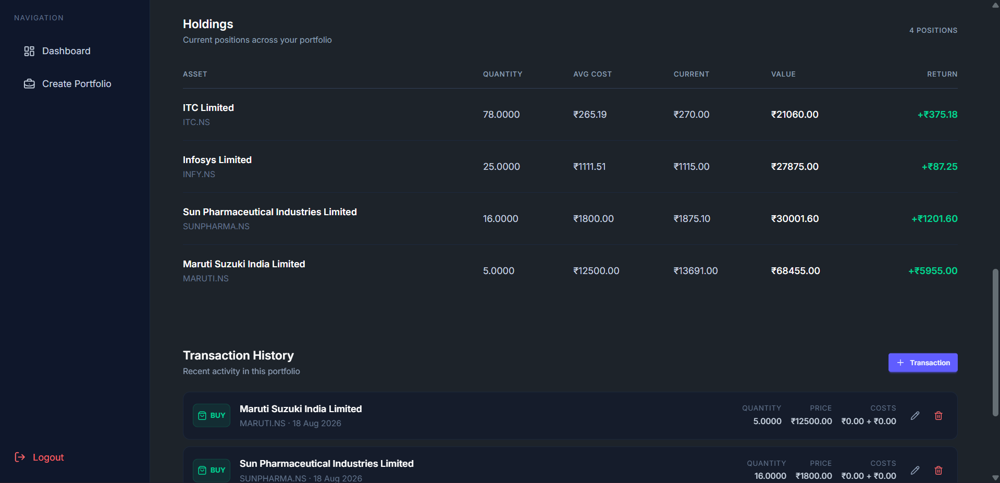
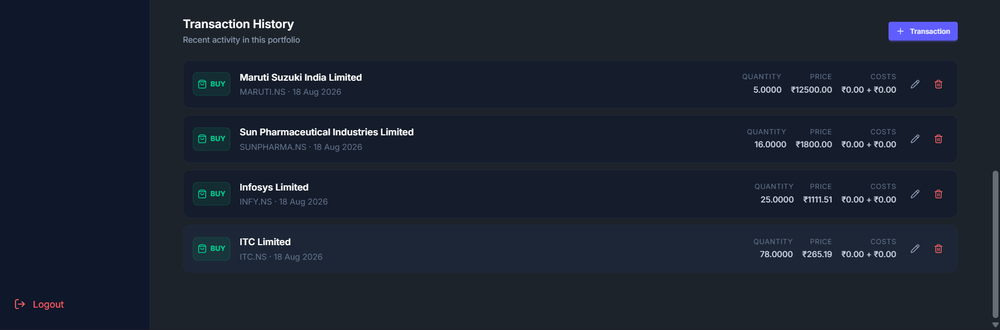
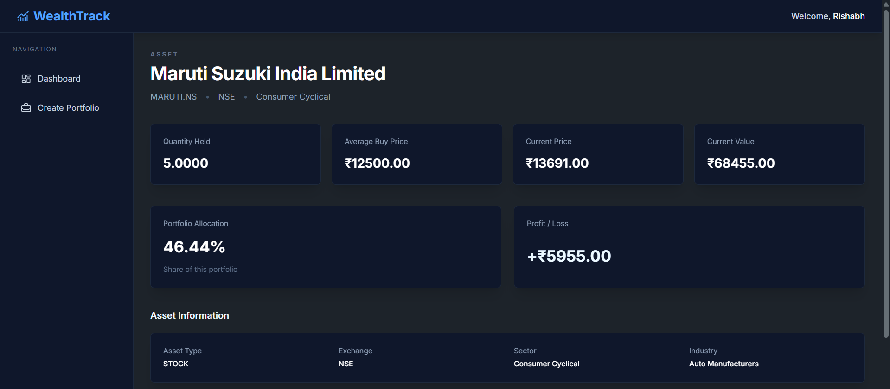
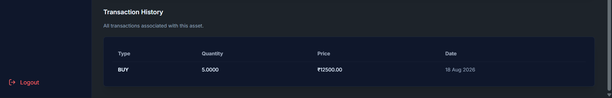

# WealthTrack — Investment Portfolio Tracker

WealthTrack is a full-stack Django application for tracking and analyzing investment portfolios across multiple asset classes.

Users can create and manage multiple portfolios, record investment transactions, track holdings, monitor market prices, and analyze portfolio performance through a unified dashboard.

> 🚧 **Active Development** — Core functionality and desktop UI are complete. Mobile responsiveness and final frontend polish are currently in progress.

---

## Screenshots

### Dashboard



### Portfolio





### Asset Detail



---

## What Makes WealthTrack Different?

Unlike simple portfolio trackers that store holdings directly, WealthTrack derives holdings from transaction history.

For example:

```text
Buy 10 TCS
Sell 2 TCS

Current Holding = 8 TCS
```

Holdings are calculated from the underlying transactions rather than being manually maintained.

This provides:

- Consistent portfolio state
- Auditable transaction history
- Automatic quantity calculations
- Average cost basis calculation
- Support for BUY, SELL, and IMPORT transactions
- A foundation for future portfolio analytics

The architecture is also designed to support multiple asset classes through a unified Asset model.

---

## Features

### Authentication
- User registration
- Login and logout
- Custom User model
- User-specific portfolio access
- Authentication-protected portfolio data

### Portfolio Management
Users can:
- Create multiple portfolios
- Update portfolios
- Delete portfolios
- Choose a base currency
- View portfolio-level performance
- Track portfolio creation information

### Transaction Management
Users can record and manage investment transactions.

Supported functionality includes:
- BUY transactions
- SELL transactions
- IMPORT transactions
- Quantity tracking
- Transaction price
- Fees
- Taxes
- Transaction date
- Notes
- Transaction validation
- Edit transactions
- Delete transactions

Transactions form the foundation of the holdings calculation engine.

### Holdings Calculation Engine
Holdings are derived automatically from transaction history.

The system calculates:
- Current quantity
- Average buy price
- Current market price
- Current value
- Profit / Loss
- Portfolio allocation
- Return percentage

For SELL transactions, the holdings engine adjusts the remaining quantity and cost basis using the portfolio's transaction history.

### Market Data
WealthTrack integrates with `yfinance` to retrieve market information and update asset prices.

The application is designed to keep portfolio valuations connected to current market prices rather than relying solely on manually entered values.

### Dashboard
The unified dashboard combines information across all user portfolios.

It provides:
- **Portfolio Summary**
  - Total invested
  - Current portfolio value
  - Total profit/loss
  - Overall return percentage
- **Allocation Analysis**
  - Combined asset allocation
  - Combined sector allocation
  - Allocation percentages
  - Exact allocation values
- **Portfolio Overview**
  - Users can quickly access all their portfolios from the dashboard

### Portfolio Analytics
Each portfolio provides a detailed analytical view containing:
- Portfolio value
- Total invested amount
- Profit/loss
- Return percentage
- Asset allocation
- Sector allocation
- Top holdings
- Best performer
- Worst performer
- Holdings table
- Transaction history

### Asset Detail Pages
Each asset has its own detail page containing:
- Asset name
- Symbol
- Asset type
- Exchange
- Sector
- Industry
- Quantity held
- Average buy price
- Current price
- Current value
- Portfolio allocation
- Profit/loss
- Transaction history

### Charts & Visualization
WealthTrack uses Chart.js for portfolio visualization.

Current visualizations include:
- Asset allocation charts
- Sector allocation charts
- Percentage-based portfolio distribution

Charts are accompanied by detailed tables so users can see both the visual distribution and the underlying values.

### Background Processing
WealthTrack uses Celery, Redis, and Celery Beat for background processing.

This architecture allows market-data updates and other scheduled operations to run independently from normal web requests.

---

## Tech Stack

**Backend**
- Python
- Django
- Django ORM

**Database**
- Development: SQLite
- Production: PostgreSQL

**Background Processing**
- Celery
- Celery Beat
- Redis

**Market Data**
- yfinance

**Frontend**
- HTML5
- Tailwind CSS
- DaisyUI
- JavaScript
- Chart.js
- Lucide Icons

---

## Architecture

```
                         Browser
                            │
                            ▼
                     Django Templates
                            │
                            ▼
                     Django Views
                            │
                            ▼
                  Dashboard / Services
                            │
                            ▼
                    Portfolio Models
                            │
                            ▼
                     Django ORM
                            │
                            ▼
                    SQLite (Development)


                  Background Processing
                            ▲
                            │
                     Celery + Redis
                            │
                       Celery Beat
                            │
                            ▼
                     Market Data
                        yfinance
```

---

## Project Structure

```
investment-portfolio-tracker/
│
├── accounts/
│   ├── models.py
│   ├── views.py
│   ├── forms.py
│   └── ...
│
├── dashboard/
│   ├── views.py
│   ├── services.py
│   ├── templates/
│   └── ...
│
├── portfolio/
│   ├── models.py
│   ├── views.py
│   ├── forms.py
│   ├── services.py
│   ├── templates/
│   └── ...
│
├── config/
│   ├── settings.py
│   ├── urls.py
│   └── ...
│
├── static/
│   ├── css/
│   └── js/
│
├── templates/
│
├── manage.py
└── requirements.txt
```

---

## Getting Started

### 1. Clone the repository

```bash
git clone https://github.com/rishabhdeepak/investment-portfolio-tracker.git
cd investment-portfolio-tracker
```

### 2. Create a virtual environment

**Windows**
```bash
python -m venv venv
venv\Scripts\activate
```

**Linux / macOS**
```bash
python -m venv venv
source venv/bin/activate
```

### 3. Install dependencies

```bash
pip install -r requirements.txt
```

### 4. Apply migrations

```bash
python manage.py migrate
```

### 5. Create a superuser

```bash
python manage.py createsuperuser
```

### 6. Start the development server

```bash
python manage.py runserver
```

Open: [http://127.0.0.1:8000/](http://127.0.0.1:8000/)

---

## Background Services

If background market-data updates are required, start the required services separately.

**Celery Worker**
```bash
celery -A config worker --loglevel=info
```

**Celery Beat**
```bash
celery -A config beat --loglevel=info
```

> Redis must also be running for Celery to communicate with the application.

---

## Development Roadmap

### Completed
- [x] Authentication System
- [x] Custom User Model
- [x] Portfolio Creation
- [x] Portfolio Update
- [x] Portfolio Deletion
- [x] Transaction Creation
- [x] Transaction Update
- [x] Transaction Deletion
- [x] Transaction Validation
- [x] Holdings Calculation Engine
- [x] Average Cost Basis Calculation
- [x] Portfolio Summary Calculations
- [x] Profit/Loss Calculations
- [x] Asset Detail Pages
- [x] Dashboard
- [x] Dashboard Allocation Analysis
- [x] Portfolio Allocation Charts
- [x] Sector Allocation Charts
- [x] Allocation Tables
- [x] Top Holdings
- [x] Best/Worst Performer Analysis
- [x] Redis Integration
- [x] Celery Integration
- [x] Celery Beat Integration
- [x] yfinance Market Data Integration
- [x] Mutual Fund Support
- [x] Desktop Frontend UI
- [x] Lucide Icon Integration

### In Progress
- [ ] Mobile Responsive UI
- [ ] Final Frontend Polish (blocked on mobile responsiveness)
- [ ] Asset Search Optimization

### Planned
- [ ] Portfolio Health Score
- [ ] CAGR Calculations
- [ ] XIRR Calculations
- [ ] Goal-Based Investment Planner
- [ ] Django REST Framework API
- [ ] PDF Portfolio Export
- [ ] Excel Portfolio Export
- [ ] PostgreSQL Production Deployment
- [ ] Docker Support
- [ ] Production Deployment

---

## Future Vision

WealthTrack is being developed as a portfolio management platform rather than a simple CRUD application.

The long-term goal is to build a system capable of handling multiple investment instruments while providing meaningful portfolio analytics, automated market-data updates, advanced performance calculations, and an API layer for future integrations.

The architecture is designed to evolve from a local Django application into a production-ready portfolio management system.

---

## Author

**Rishabh D**

B.Tech Computer Science & Engineering
IIIT Kottayam

GitHub: [https://github.com/rishabhdeepak](https://github.com/rishabhdeepak)